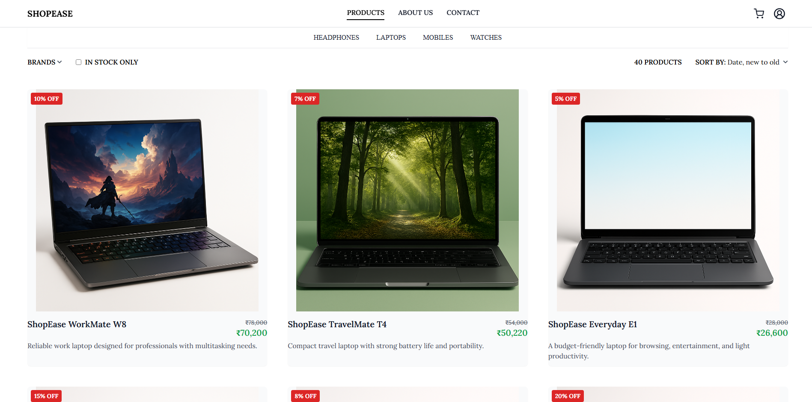
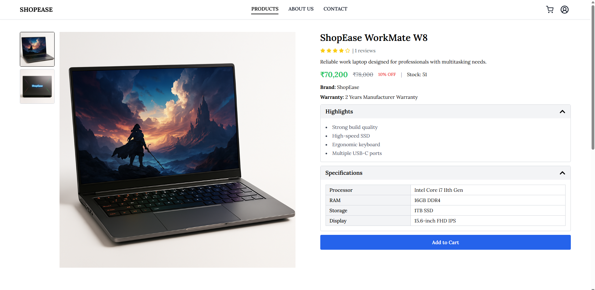
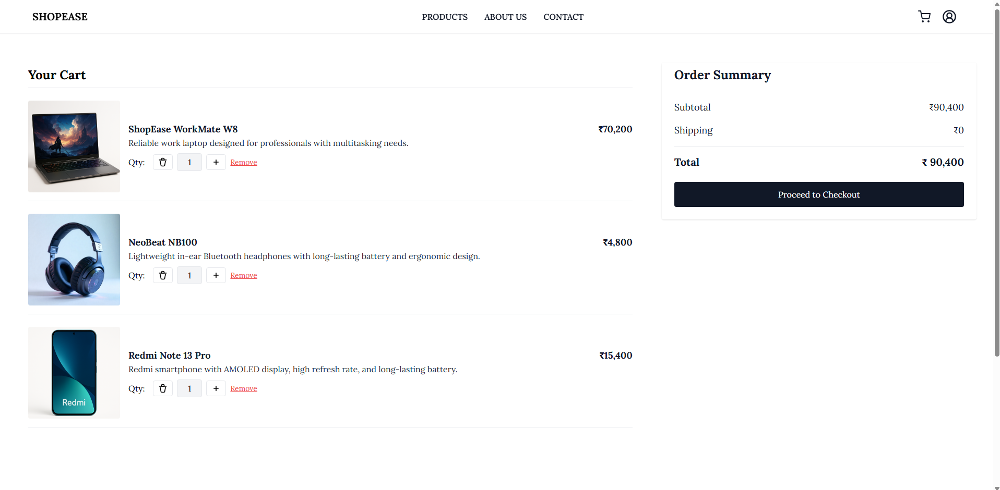
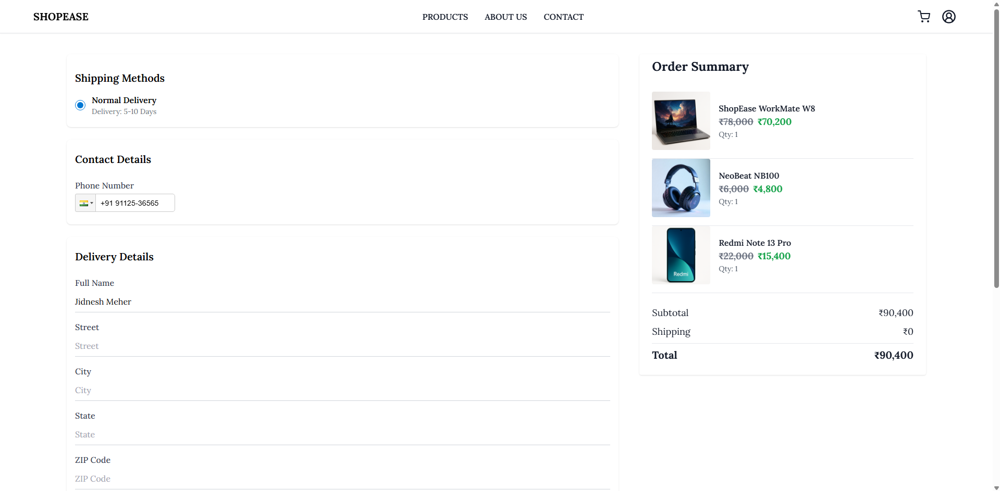
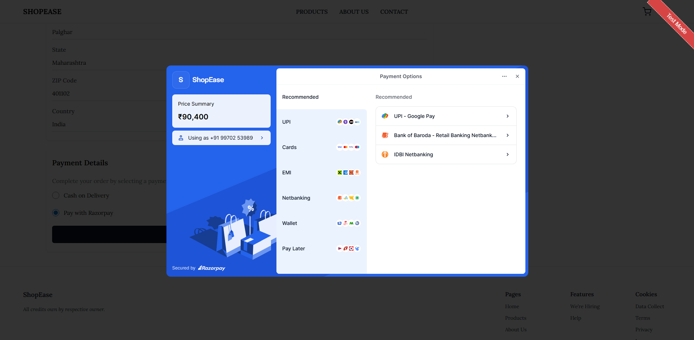
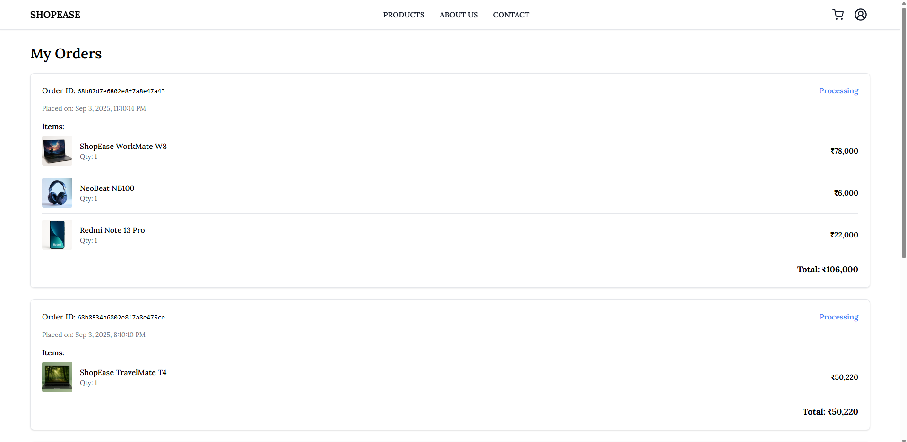

# 🛒 ShopEase – E-Commerce Website

ShopEase is a modern and responsive **full-stack e-commerce application** built with the MERN stack.
It provides a real shopping experience with product listings, filtering, cart, checkout, and secure payments.

---

## 🚀 **Live Demo**

🔗 **Deployed App:** [https://shopease-frontend-umber.vercel.app](https://shopease-frontend-umber.vercel.app)

- Frontend: Vercel
- Backend: Render
- Database: MongoDB Atlas
---

## ✨ **Features**

* 🏬 **Product Catalog** – Browse 30+ products with images and details
* 🔍 **Filters & Sorting** – Brand, category, stock availability, and sorting options
* 🛒 **Cart & Checkout** – Add/remove items and proceed to checkout
* 💳 **Payment Integration** – Razorpay integration for secure payments
* 🔑 **Authentication** – Register/Login with role-based access
* ✉️ **Email Notifications** – Order confirmations via Nodemailer
* 📱 **Responsive Design** – Optimized for mobile, tablet, and desktop
* ⚡ **Fast & Modern UI** – Built with React + Tailwind CSS

---


## 🛠️ **Tech Stack**

### **Frontend:**

* React.js (Vite)
* Tailwind CSS
* Redux Toolkit
* React Router
* GSAP (animations)
* Axios

### **Backend:**

* Node.js + Express.js
* MongoDB
* JWT Authentication
* Nodemailer (emails)
* Razorpay (payments)
* Cloudinary (image uploads)
* Multer (file handling)

---

## 📂 **Folder Structure**

```bash
ShopEase/
├── client/               # Frontend (React + Vite)
│   └── src/
│       ├── app/          # Application-level setup (Redux store)
│       ├── assets/       # Images, fonts, icons
│       ├── components/   # Reusable UI components
│       ├── config/       # Config files
│       ├── features/     # Domain-specific logic (auth, products, cart)
│       ├── layouts/      # Layout components
│       ├── pages/        # Route-level components
│       ├── services/     # API calls and service logic
│       ├── styles/       # Global CSS and Tailwind setup
│       ├── utils/        # Helper functions
│       ├── App.jsx       # Root React component
│       ├── main.jsx      # React DOM rendering entry point
│       └── routes.jsx    # App routing configuration
├── server/               # Backend (Node.js + Express)
│   └── src/
│       ├── controllers/  # Handlers for API routes
│       ├── middlewares/  # Custom Express middleware functions
│       ├── models/       # Database models
│       ├── routes/       # API routes
│       ├── utils/        # Helper functions
│       ├── app.js        # Express app setup
│       └── index.js      # Server entry point
```

---

## ⚙️ **Installation & Setup**

### 1️. **Clone the Repository**

```bash
git clone https://github.com/jidneshmeher/ShopEase.git
cd ShopEase
```

### 2️. **Install Dependencies**

* **Frontend (client)**

```bash
cd client
npm install
```

* **Backend (server)**

```bash
cd ../server
npm install
```

### 3️. **Configure Environment Variables**

Both `client/` and `server/` contain a `.env.sample` file. Copy it to `.env` and fill in your own values.

* **Server (`server/.env`)**

```env
PORT=5000
MONGODB_URI=your_mongodb_connection_string
NODE_ENV=development
JWT_SECRET=your_jwt_secret
CLOUDINARY_CLOUD_NAME=your_cloud_name
CLOUDINARY_API_KEY=your_cloudinary_api_key
CLOUDINARY_API_SECRET=your_cloudinary_api_secret
RAZORPAY_KEY_ID=your_razorpay_key_id
RAZORPAY_KEY_SECRET=your_razorpay_key_secret
SMTP_HOST=your_smtp_host
SMTP_PORT=your_smtp_port
SMTP_SECURE=true
SMTP_USER=your_smtp_user
SMTP_PASS=your_smtp_pass
CLIENT_URL=your_client_url
BACKEND_URL=your_backend_url
```

* **Client (`client/.env`)**

```env
VITE_API_BASE_URL=your_api_base_url
```

### 4️. **Run the Development Server**

* **Start the backend**

```bash
cd server
npm run dev
```

* **Start the frontend**

```bash
cd ../client
npm run dev
```

---

## 📸 **Screenshots**

### 🏠 Home Page


### 🛍️ Products Page


### 📄 Product Details Page


### 🛒 Cart Page


### 💳 Checkout Page


### 💰 Payment Page


### 📦 Order Summary Page


---

## 👨‍💻 Author

**Jidnesh Meher**

- GitHub: [github.com/jidnesh](https://github.com/jidneshmeher)  
- LinkedIn: [linkedin.com/in/jidneshmeher](https://linkedin.com/in/jidneshmeher)  
- Email: meherjidnesh89@gmail.com

---